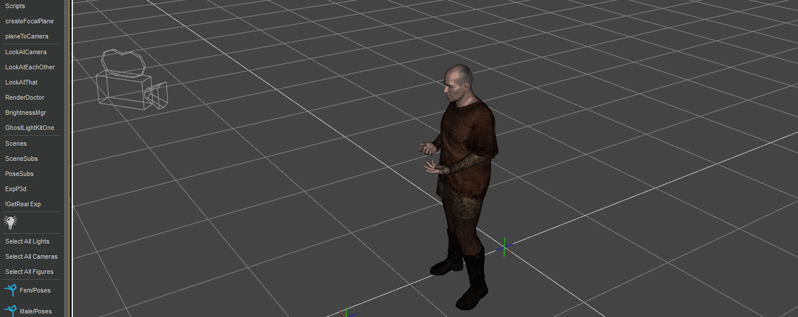

# FocalPointViewer
 A pair of scripts to make setting the focal point easy
 How to use: 
Select your camera. 
Run createFocalPlane.dsa 
use the Z translate to adjust the plane's distance to the camera. 
Run planeToCamera.dsa 
You can now delete the plane. 
 